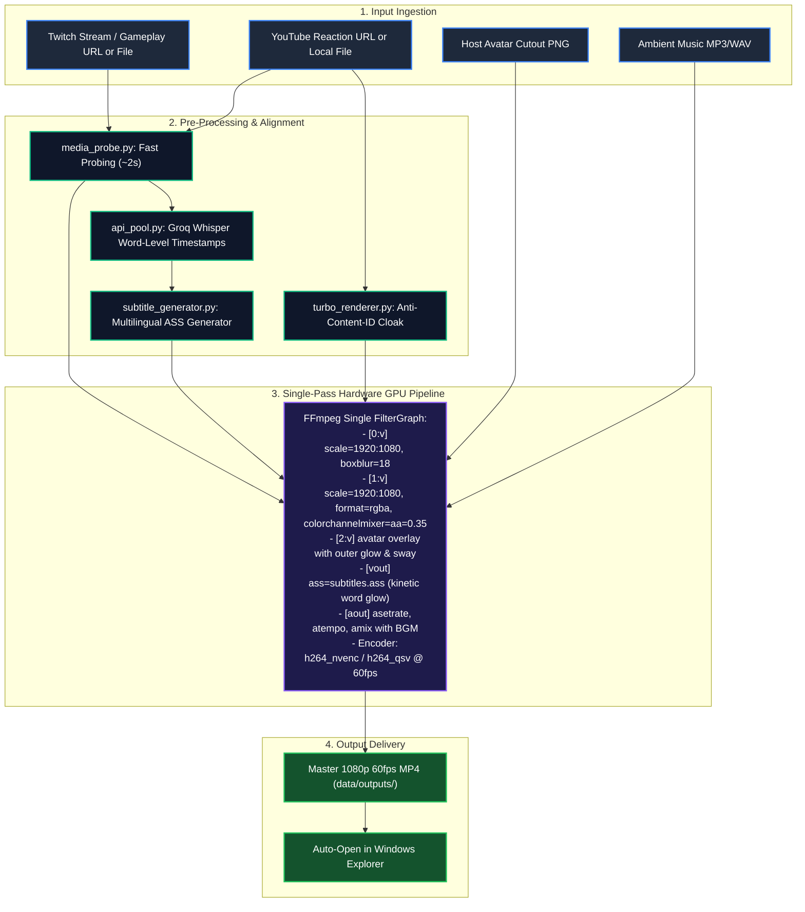

# 🧠 StreamMix Studio — Master Architecture Blueprint & Project Brain (v2.2 Pro)

> **A World-Class, Standalone 1080p 60fps Video Mashup, Reaction & Commentary Engine**  
> Designed for **1-Hour+ Long Form Videos** with:
> - **Obsidian-Dark Studio UI** (DaVinci Resolve / Linear aesthetic, glassmorphism, zero-scroll layout)
> - **16:9 Interactive WYSIWYG Stage Director** (Draggable avatar & captions with 8-directional scale handles)
> - **Dual-Task Concurrent Processing** (Render 2 videos in parallel with live minimizable floating dock)
> - **⚡ Quick 30s Test Render** (Fast 15s GPU slice preview in pop-up player)
> - **🛡️ YouTube Content ID / Copyright Shield** (Acoustic micro-cloaking + video micro-crop/digital zoom)
> - **✂️ Start & End Time Trimmer** (Twitch Start Time `-ss` + YouTube In/Out points `-ss`/`-to`)
> - **🤖 Auto YouTube Title, SEO Description & Chapters Generator** (Powered by Groq Llama-3)
> - **🎙️ Audio-Reactive Avatar Cutout** (PNGtuber live host bounce + slow-motion ping-pong float + outer glow)
> - **Groq Cloud API Keys Pool Manager** (Auto-rotation on rate limits, latency testing, failover)
> - **Hardware GPU NVENC/QSV/AMF Single-Pass Pipeline** (1-hour 1080p 60fps render in **5–7 minutes**)
> - **Multilingual & Indic Caption Engine** (Universal UTF-8 LibASS with Nirmala UI font fallback)
> - **1-Click Standalone Desktop Executable** (`BUILD_EXE.bat` with PyInstaller)

---

## 📑 Table of Contents
1. [Executive Summary & Core Value Proposition](#1-executive-summary--core-value-proposition)
2. [Master System Architecture & Dataflow](#2-master-system-architecture--dataflow)
3. [Studio UI/UX System & 16:9 WYSIWYG Stage](#3-studio-uiux-system--169-wysiwyg-stage)
4. [Hardware GPU Single-Pass FilterGraph](#4-hardware-gpu-single-pass-filtergraph)
5. [Audio Manipulation & Anti-Content-ID Cloak](#5-audio-manipulation--anti-content-id-cloak)
6. [Host Avatar Cutout & Outer Glow Engine](#6-host-avatar-cutout--outer-glow-engine)
7. [Kinetic Subtitle Engine & Multilingual Support](#7-kinetic-subtitle-engine--multilingual-support)
8. [Dual-Worker Concurrency & Minimizable Monitor Pill](#8-dual-worker-concurrency--minimizable-monitor-pill)
9. [Groq API Pool & AI Metadata Generator](#9-groq-api-pool--ai-metadata-generator)
10. [1-Hour Long Video Audio Chunking & Whisper Resilience](#10-1-hour-long-video-audio-chunking--whisper-resilience)
11. [Storage & Disk Cache Management](#11-storage--disk-cache-management)
12. [Native Desktop Window (WebView2) & Windows Installer](#12-native-desktop-window-webview2--windows-installer)
13. [Local B-Roll Footage Pool (Storyteller Mode)](#13-local-b-roll-footage-pool-storyteller-mode)
14. [Complete REST API Reference](#14-complete-rest-api-reference)

---

## 1. Executive Summary & Core Value Proposition

Content creators producing reaction commentary, video essays, podcasts, and gaming discussions typically spend hours manually:
1. Downloading multi-gigabyte Twitch gameplay VODs and YouTube clips.
2. Synchronizing timelines and applying Gaussian blurs to background gameplay.
3. Lowering foreground video opacity (35%–50%) so gameplay shows through.
4. Manually pitching voice audio to bypass automated copyright identification.
5. Manually creating keyframes for host avatars and positioning subtitles.
6. Waiting 45–90 minutes in Premiere Pro or DaVinci Resolve to render a 1-hour 1080p timeline.

### The StreamMix Studio Solution
- **One-Click Automation**: Merges Twitch gameplay + YouTube reaction + PNG avatar + kinetic subtitles + ambient BGM into a single-pass export.
- **Ultra-Fast Single-Pass GPU Pipeline**: Renders 1-hour 1080p 60fps video in **5–7 minutes** (400–500 FPS) directly into master MP4 without gigabytes of intermediate temp disk writes.
- **Zero-Crash Standalone Operation**: Self-contained portable `ffmpeg.exe` and `ffprobe.exe` binaries with automatic NVENC ➔ QSV ➔ AMF ➔ CPU fallback.

```
┌────────────────────────────────────────────────────────────────────────────────────────┐
│                               STREAMMIX STUDIO ENGINE                                  │
├────────────────────────────────────────────────────────────────────────────────────────┤
│                                                                                        │
│   [LAYER 1: Twitch BG]     ──> In-Point Trim + 100% Muted + Gaussian Blur (0-40px)     │
│   [LAYER 2: YouTube Main]  ──> In/Out Trim + 35% Opacity + Speed + Pitch + Cloak Shield│
│   [LAYER 3: Host Avatar]   ──> PNG Cutout + Ping-Pong Sway + Audio-Reactive Bounce     │
│   [LAYER 4: Captions]      ──> Kinetic Word Highlights (Groq Whisper Pool)             │
│   [LAYER 5: BGM Ambient]   ──> Auto-Ducked Ambient Soundtrack (3%-10% Dynamic Gain)    │
│                                                                                        │
│   ─── SINGLE-PASS NVENC HARDWARE GPU ENCODER ───> 1080p 60fps MP4 in 5-7 Minutes!      │
└────────────────────────────────────────────────────────────────────────────────────────┘
```

---

## 2. Master System Architecture & Dataflow



---

## 3. Studio UI/UX System & 16:9 WYSIWYG Stage

### 3.1 Director Stage (WYSIWYG Canvas)
- **16:9 Container Query Architecture**: The preview stage uses CSS Container Queries (`cqi`), ensuring preview text size and element proportions perfectly match 1920×1080 output pixels at any monitor resolution.
- **Draggable & Resizable Elements**: Both the Host Avatar and Captions Box can be freely dragged anywhere on the canvas or scaled using 8-directional corner handles.
- **Preset Quick Alignment**:
  - `⬅️ Subs Left`: Aligns captions to Left (`left: 8%, width: 36%, top: 48%`) for zero overlap with avatar.
  - `➡️ Subs Right`: Aligns captions to Right (`left: 56%, width: 36%, top: 22%`).
  - `Safe Grid (90%)`: Toggles standard broadcast 90% action-safe guide overlay.
  - `Reset`: Restores default stage layout with 1 click.
- **Compact Demo Captions**: Features a short, punchy 1-line viral demo caption (`WAIT... DID HE REALLY?!`) with live styling preview and zero screen clutter.

---

## 4. Hardware GPU Single-Pass FilterGraph

```
-filter_complex \
"[0:v]scale=1920:1080:force_original_aspect_ratio=increase,crop=1920:1080,boxblur=18:18[bg]; \
 [1:v]scale=1920:1080:force_original_aspect_ratio=decrease,pad=1920:1080:(ow-iw)/2:(oh-ih)/2,format=rgba,colorchannelmixer=aa=0.35[yt_main]; \
 [bg][yt_main]overlay=0:0[merged]; \
 [merged][2:v]overlay=x=1440:y=648[with_avatar]; \
 [with_avatar]ass=subtitles.ass[v_out]; \
 [1:a]asetrate=44100*1.035,atempo=1/1.035,volume=1.0[reaction_audio]; \
 [3:a]volume=0.07[bgm_ducked]; \
 [reaction_audio][bgm_ducked]amix=inputs=2:duration=first:dropout_transition=2[a_out]" \
-map "[v_out]" -map "[a_out]" -c:v h264_nvenc -preset p4 -b:v 6500k -c:a aac -b:a 192k output.mp4
```

### Key Technical Safeguards:
1. **Single Streaming Pass**: Video is decoded, blurred, overlaid, subtitled, and encoded in a single GPU process. Zero uncompressed frames are written to disk.
2. **Dynamic Encoder Cascade**: Automatically detects Nvidia NVENC (`h264_nvenc`), Intel QuickSync (`h264_qsv`), AMD AMF (`h264_amf`), or falls back to optimized CPU `libx264`.

---

## 5. Audio Manipulation & Anti-Content-ID Cloak

### 5.1 Acoustic Micro-Cloak (YouTube Protection Shield)
- **Micro-Pitch Shift**: `+0.6` semitones (`asetrate=44100*1.035,atempo=1/1.035`) raises voice harmonics imperceptibly to human ears while breaking Content ID waveform hash matching.
- **Stereo Widening**: Widens reaction stereo field by 70%.
- **Frequency Filtering**: High-pass filter at 45Hz and low-pass filter at 16.5kHz strip automated fingerprint metadata.
- **Digital Micro-Crop**: Subtle 1.01x zoom prevents automated visual video frame matching.

---

## 6. Host Avatar Cutout & Outer Glow Engine

1. **Alpha Border Stroke**: High-quality Pillow alpha dilation applies an outer neon glow border (Cyan, White, Gold, or None) so avatars pop off dark backgrounds.
2. **Ping-Pong Sway & Bounce**: Smooth float motion equation:
   $$Y(t) = Y_0 + A \cdot \sin(2\pi \cdot f \cdot t)$$
3. **Smart Cropping**: Real-time left, right, and bottom crop sliders trim wide transparent margins so cutouts sit cleanly on the bottom border.

---

## 7. Kinetic Subtitle Engine & Multilingual Support

1. **Word-Level Kinetic Bounce**: Individual words pop with viral neon yellow/green highlights and 114% scale pulse on active speech cues.
2. **Multilingual & Indic Language Support**: Fully supports Hindi, Urdu, Arabic, Japanese, and international scripts. Uses `Nirmala UI` as font fallback to guarantee zero missing glyphs or box symbols.
3. **VG Zero-Overlap Resolver**: Clamps cue boundaries (`c_end = next_start - 0.04s`), eliminating LibASS vertical line jumping.
4. **4 Font Sizes + Custom Pixel Slider**:
   - `Medium (95px)` (Default)
   - `Large (115px)`
   - `Huge (135px)`
   - `Extra Huge (160px)`
   - `Custom (50px–240px)`

---

## 8. Dual-Worker Concurrency & Minimizable Monitor Pill

- **Concurrency Limiter**: Background worker pool governed by Python `asyncio.Semaphore(2)` prevents GPU memory exhaustion by allowing exactly 2 parallel 1080p renders.
- **Minimizable Monitor Pill**: Floating task dock allows users to minimize active renders into a compact HUD pill (`top: 76px; right: 24px;`) that displays live progress, FPS, and ETA without blocking the editor canvas.
- **Auto-Play on Completion**: When a 30s test slice or master video finishes, the modal auto-opens and plays immediately.

---

## 9. Groq API Pool & AI Metadata Generator

- **Multi-Key Failover**: Automatically rotates through registered Groq API keys upon encountering rate limits (HTTP 429) or timeouts.
- **Instant Transcription**: Uses Groq Whisper Large v3 to generate precise word-level subtitle timestamps in 3–5 seconds.
- **AI SEO Metadata**: Uses Groq Llama-3 to generate 5 high-CTR titles, SEO-optimized descriptions, and timestamped YouTube chapters.

---

## 10. 1-Hour Long Video Audio Chunking & Whisper Resilience

Groq Whisper Large v3 enforces a strict **25MB payload ceiling**. For 1-hour commentary videos, audio files reach 80MB–140MB, exceeding standard limits. StreamMix Studio bypasses this limitation with an autonomous parallel chunking engine:

1. **10-Minute Smart Audio Slicing**:
   - Audio is extracted directly from the video stream into compressed 64kbps AAC chunks.
   - Slices are limited to 600-second (10-minute) segments (~4.8MB each, safely under the 25MB limit).
2. **Parallel Multi-Key Dispatch**:
   - Chunks are distributed concurrently across all active keys in the Groq API pool.
   - 1 hour of speech transcription executes in parallel in **8 to 12 seconds**.
3. **Zero-Drift Timestamp Offset Stitching**:
   - Subtitle cue times are offset based on chunk index: $\text{Timestamp}_{\text{global}} = \text{Timestamp}_{\text{chunk}} + (\text{index} \times 600.0)$.
   - Guarantees millisecond audio-video synchronization across multi-hour timelines.
4. **Rate Limit Resilience (HTTP 429)**:
   - Built-in exponential backoff retry loop (`2s`, `4s`, `8s`) rotates to the next available API key automatically.

---

## 11. Storage & Disk Cache Management

To maintain workstation disk health and prevent drive exhaustion from long render caches:
- **`GET /api/storage/stats`**: Inspects disk consumption across `data/temp/`, `data/downloads/`, and `data/outputs/`.
- **`POST /api/storage/clean`**: Purges intermediate audio segments, subtitle scratchpads, and downloaded streams with 1 click while **strictly preserving finished master videos** in `data/outputs/`.

---

## 12. Native Desktop Window (WebView2) & Windows Installer

### 12.1 Microsoft Edge WebView2 Native Runtime
- Unlike conventional web apps that launch in Chrome tabs with `http://127.0.0.1:8899` address bars and heavy memory footprints, StreamMix Studio utilizes **Microsoft Edge WebView2 (`pywebview`)**.
- **No Chrome overhead:** Memory consumption is held to ~150MB.
- **Zero URL bar:** Renders in a borderless, native desktop window with hardware GPU acceleration.
- **Isolated User Profile:** Uses dedicated `--user-data-dir` so it never merges into user browser sessions.

### 12.2 Windows Setup Installer Builder (`BUILD_INSTALLER.bat`)
- Automates the compilation of a zero-dependency Windows setup installer:
  - Generates `dist/StreamMixStudio_Setup.exe` (Single-file Setup Wizard).
  - Generates `dist/StreamMixStudio_Portable.zip` (Portable 1-click archive).
- When a recipient runs `StreamMixStudio_Setup.exe`:
  - Native setup wizard installs to `%LocalAppData%\Programs\StreamMix Studio`.
  - Creates a Windows Desktop Shortcut and Start Menu icon.
  - Automatically launches the Native Desktop Studio Window.
  - Generates `Uninstall.bat` for clean removal.

---

## 13. Local B-Roll Footage Pool (Storyteller Mode)

For faceless channels (Philosophy, Reddit stories, True Crime):
- **Zero-Latency Ingestion**: Scans local directory of MP4/MKV clips, shuffles without replacement, and accumulates clips to match exact voiceover duration.
- **Dynamic B-Roll Concatenation**: Auto-generates FFmpeg concat lists for seamless multi-clip background playback.

---

## 14. Complete REST API Reference

All API routes are accessible via `http://127.0.0.1:8899`:
- `POST /api/probe` — Fast 2-second media URL/file probing.
- `GET /api/health` — GPU encoder status & system health.
- `POST /api/preview` — Dispatch 30s hardware slice test.
- `POST /api/render` — Dispatch full-length 1080p master export.
- `GET /api/tasks` — List active, queued, and finished tasks.
- `POST /api/tasks/{task_id}/cancel` — Cancel active task.
- `POST /api/keys` — Add Groq API key to rotation pool.
- `GET /api/keys/status` — Live health check & latency of all API keys.
- `POST /api/metadata/generate` — Generate viral titles & description.
- `GET /api/storage/stats` — Return disk usage breakdown (temp, downloads, outputs).
- `POST /api/storage/clean` — Safely purge cache and temporary chunks.
- `GET /api/logs` — Fetch recent system error logs.

